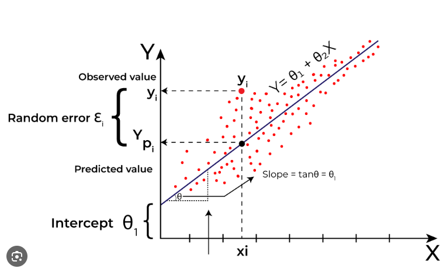
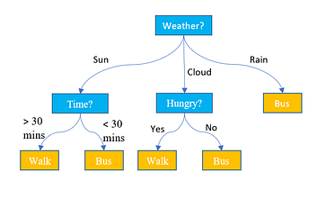
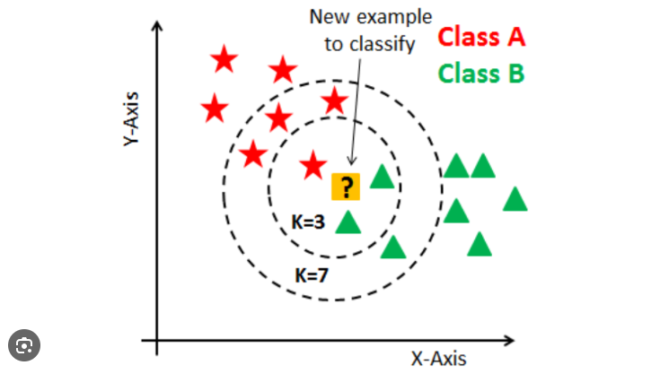
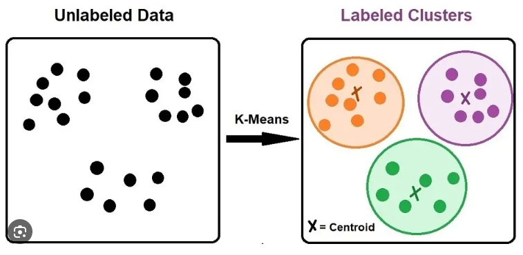

# Types of ML models

## 1. Linear Models (The Rule-Based Scorers)
These models assume that the relationship between the inputs and the output follows a smooth, predictable line or curve. They work by assigning a fixed "weight" (importance) to every feature.

* **Examples:** Linear Regression, Logistic Regression, Ridge/Lasso Regression.

* **How they think:** Like a standard medical risk calculator (e.g., the Framingham Risk Score). They add up the weighted points of various symptoms to get a final score.
* **When to use them:**
    * **The Baseline:** Always start here. They are fast, cheap, and set a performance baseline.
    * **Extreme Explainability:** When you need to know exactly *how much* a single variable impacts the outcome (e.g., proving to regulators that a model doesn't use biased criteria).
    * **Small Datasets:** They are less prone to overfitting when data is scarce.
* **When NOT to use them:** When the data has complex, non-linear relationships (e.g., if a drug is helpful in small doses but toxic in large doses, a simple linear model will struggle to map that U-shape).

## 2. Tree-Based & Ensemble Models (The Flowcharts)
Instead of math equations, these models use logic. They split the data by asking a series of "If/Then" questions (e.g., "Is age > 60?" -> "Is blood pressure > 140?").

* **Examples:** Decision Trees, Random Forest, Gradient Boosting Machines (XGBoost, LightGBM).
* **How they think:** Like a clinical triage protocol. A single Decision Tree is one protocol. An "Ensemble" (like a Random Forest) acts like a Tumor Board—it asks 1,000 different decision trees for their opinion and takes a majority vote.
* **When to use them:**
    * **Tabular Data:** If your data lives in a spreadsheet, SQL database, or an EHR system, **XGBoost** or **Random Forest** will almost always be your best-performing models.
    * **Messy Data:** They handle missing values and mixed data types (categorical and numerical) very well without needing heavy preprocessing. Outliers also can be handled without data pre-processing.
    * **Non-Linear Relationships:** They easily capture threshold effects (e.g., "Risk only increases *after* BMI hits 30").

## 3. Distance-Based Models (The Analogizers)
These models make decisions based on physical proximity in a mathematical space. 

* **Examples:** K-Nearest Neighbors (KNN), Support Vector Machines (SVM).

* **How they think:** * **KNN:** "You are who your neighbors are." To diagnose a new patient, the model looks at the 5 historical patients whose lab results look the most identical and copies their diagnosis.
    * **SVM:** "Drawing boundaries." It tries to draw the widest possible "street" or boundary line between different categories of data.
* **When to use them:**
    * **Instance-Based Explanation:** KNN is great when a user asks "Why did you make this prediction?" because you can show them the exact 5 historical records the model used to make the decision.
    * **Complex Boundaries (SVM):** SVMs (using something called the "Kernel trick") are excellent when the boundary between healthy and sick is highly complex and multi-dimensional, but the dataset isn't massive enough for Deep Learning.

## 4. Unsupervised Models (The Organizers)
All the models above are *Supervised* (they learn from historical labeled answers). *Unsupervised* models are given raw data with no labels and are asked to find hidden structures.

* **Examples:** K-Means Clustering, Principal Component Analysis (PCA), Isolation Forests.

* **How they think:** Like an epidemiologist looking for patterns in a new outbreak without knowing what the disease is yet.
* **When to use them:**
    * **Discovery / Clustering (K-Means):** Discovering new patient phenotypes (e.g., finding out that "Type 2 Diabetes" actually consists of 3 distinct sub-clusters based on lab profiles).
    * **Anomaly Detection (Isolation Forest):** Flagging fraudulent insurance claims or dangerous physiological vitals by finding the "weirdest" data points that don't fit the normal clusters.
    * **Dimensionality Reduction (PCA):** Compressing a dataset with 5,000 variables down to the 50 most important statistical components to make other models run faster.

## 5. Neural Networks (Deep Learning)
While technically a different branch than classical statistical ML, they complete the picture. 

* **Examples:** Multi-Layer Perceptrons (MLPs), Convolutional Neural Networks (CNNs).
* **How they think:** Through layers of interconnected nodes that automatically extract features, similar to the visual cortex.
* **When to use them:** **Unstructured Data.** If you have pixels (X-rays, MRIs), audio waves (heart sounds), or raw text (clinical notes), Neural Networks are mandatory. They generally underperform on standard tabular spreadsheet data compared to XGBoost, considering the compute cost.

## The Decision Matrix: What to use when?

Here is a practical heuristic for choosing an architecture:

| The Problem Context | Your Go-To Model | Why? |
| :--- | :--- | :--- |
| **"I need to prove exactly how this works to a regulator."** | **Logistic Regression** | Total transparency. You can read the exact weight of every variable. |
| **"I have a massive spreadsheet of patient history and need the highest accuracy."** | **XGBoost / LightGBM** | They dominate tabular data competitions (like Kaggle) and handle non-linear interactions natively. |
| **"I need to recommend treatments based on similar past patients."** | **K-Nearest Neighbors** | Highly intuitive explanation: "We recommend X because these 3 similar patients responded well to it." |
| **"I have thousands of unlabeled records and want to see if natural groups exist."** | **K-Means Clustering** | Perfect for segmenting populations without prior bias. |
| **"I have 10,000 MRI scans."** | **Convolutional Neural Network (CNN)** | Statistical ML models cannot read pixels effectively; deep learning is required. |

When architecting a solution, the best practice is usually to start with a Linear Model to get a baseline, move to a Random Forest to see how much performance you gain from non-linearity, and finally tune an XGBoost model for production if the performance boost justifies the slight loss in explainability.

---
 
 
 

# Core Statistical Concepts

To understand machine learning, you have to understand the shape of data. These foundational statistical concepts are how we mathematically describe that "shape." 
Think of a dataset as a cluster of stars; these metrics tell us where the center of the cluster is, and how widely the stars are scattered.

### 1. The Mean (The "Center of Gravity")
The mean (average) is the mathematical center of your data. If your data points were physical weights on a seesaw, the mean is the exact point where the seesaw would balance perfectly.

* **Population Mean ($\mu$):** Used when you have data for the *entire* population.
* **Sample Mean ($\bar{x}$):** Used when you only have a sample of the population.

**The Formula:**
$$\mu = \frac{\sum_{i=1}^{N} x_i}{N}$$
* $\sum$ means "sum of".
* $x_i$ represents each individual data point.
* $N$ is the total number of data points.

### 2. Variance (The "Squared Spread")
Knowing the center isn't enough. Are all the patients 50 years old, or is half the group 20 and the other half 80? Both have a mean of 50, but totally different risk profiles. 

Variance measures the average *squared* distance of each data point from the mean. 
* **Why squared?** Two reasons: First, it makes all distances positive (so a point 5 units below the mean doesn't cancel out a point 5 units above it). Second, squaring heavily penalizes outliers (a point 10 units away adds 100 to the variance, making the model pay attention to extremes).

**The Formula (Population Variance, $\sigma^2$):**
$$\sigma^2 = \frac{\sum_{i=1}^{N} (x_i - \mu)^2}{N}$$

*(Note: If calculating for a sample, we divide by $N-1$ instead of $N$ to correct for statistical bias, known as Bessel's correction).*

### 3. Standard Deviation (The "Practical Spread")
The problem with variance is the units. If you are measuring a patient's weight in kilograms, the variance is in "squared kilograms," which is medically meaningless. 

Standard Deviation is simply the square root of the variance. It brings the measurement of "spread" back into the original units of your data. 

**The Formula (Population Standard Deviation, $\sigma$):**
$$\sigma = \sqrt{\frac{\sum_{i=1}^{N} (x_i - \mu)^2}{N}}$$

**The Empirical Rule (The 68-95-99.7 Rule):**
In a perfectly normal distribution (a bell curve), the standard deviation gives us a magical shortcut to understand probabilities:
* $\approx \mathbf{68\%}$ of all data falls within **$1\sigma$** of the mean.
* $\approx \mathbf{95\%}$ falls within **$2\sigma$** of the mean.
* $\approx \mathbf{99.7\%}$ falls within **$3\sigma$** of the mean.

---

### 4. Median and Mode (The Alternatives)
Because the Mean and Variance are heavily influenced by outliers, we often look at alternative measures of the "center".

* **Median:** The literal middle value when all data points are sorted from smallest to largest. If Bill Gates walks into a bar of 10 people, the *Mean* wealth skyrockets, but the *Median* wealth barely moves. It is highly robust to outliers.
* **Mode:** The most frequently occurring value in the dataset.

---

## Binary vs. Multi-Class Classification

In the context of Logistic Regression, the difference lies in the number of possible outcomes and how the model maps input to those categories.

### Binary Classification
* **The Goal:** Predict one of two mutually exclusive classes (e.g., $0$ for "Healthy", $1$ for "Sick").
* **The Output:** A single probability value $P$ between $0$ and $1$.
* **Decision Logic:** If $P > 0.5$, classify as $1$; otherwise, classify as $0$.
* **The Function:** Uses the **Sigmoid** function to squash a single linear value $z$ into a probability.

### Multi-Class Classification
* **The Goal:** Predict one of $K$ classes (e.g., $0$ for "Covid", $1$ for "Flu", $2$ for "Pneumonia").
* **The Output:** A **vector** of $K$ probabilities that all sum up to $1$.
* **Decision Logic:** The class with the highest probability ($Argmax$) is chosen as the prediction.
* **The Strategy (One-vs-Rest):** Standard Logistic Regression handles this by training $K$ separate binary classifiers (one for each class vs. all others). However, the more elegant mathematical solution is **Multinomial Logistic Regression**, which uses the **Softmax** function.

## 2. Mathematical Definition of Softmax

While Sigmoid is used for a single output, **Softmax** is the multi-dimensional generalization that handles multiple scores simultaneously.

### The Problem
When dealing with $K$ classes, the model generates $K$ separate linear scores (logits):
$$z_1, z_2, \dots, z_K$$
These scores could be any real numbers (e.g., $5.2, -1.1, 0.4$). We cannot use them as probabilities directly because they don't sum to $1$.

### The Solution: The Softmax Formula
The Softmax function takes the vector of scores $z$ and transforms each score into a probability $P_i$:

$$\sigma(z)_i = \frac{e^{z_i}}{\sum_{j=1}^{K} e^{z_j}}$$

### Breaking Down the Math:
1.  **Exponentials ($e^{z_i}$):** We take the exponent of each score. This ensures every result is positive (probabilities cannot be negative) and exponentially amplifies the differences between scores (making the "winner" stand out).
2.  **Normalization ($\sum e^{z_j}$):** We divide each individual exponentiated score by the sum of *all* exponentiated scores. This ensures that when you add all resulting probabilities together, the sum is exactly $1.0$ (or $100\%$).

## 3. Comparison Summary

| Feature | Sigmoid (Binary) | Softmax (Multi-class) |
| :--- | :--- | :--- |
| **Input** | A single value $z$ | A vector of scores $[z_1, z_2, \dots, z_K]$ |
| **Output** | A single probability $P$ | A set of probabilities $[P_1, P_2, \dots, P_K]$ |
| **Constraint** | $0 \le P \le 1$ | $\sum_{i=1}^{K} P_i = 1$ |
| **Clinical Example** | "Is this tumor malignant?" | "Which specific variant of cancer is this?" |

---